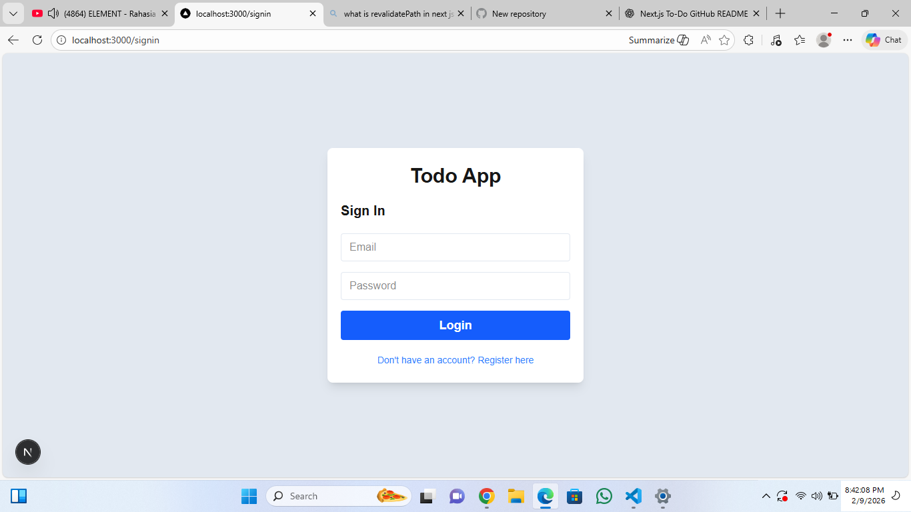
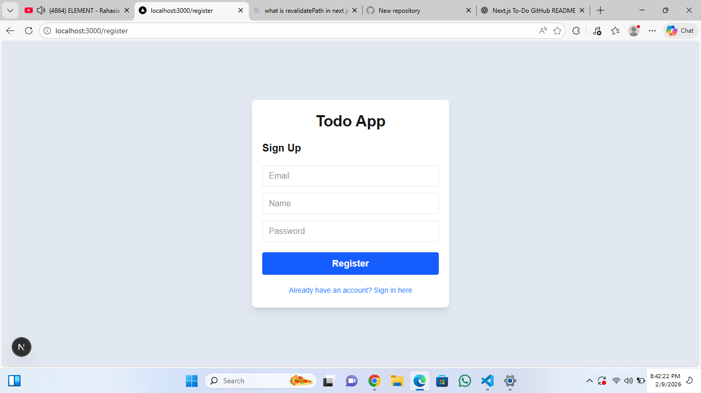
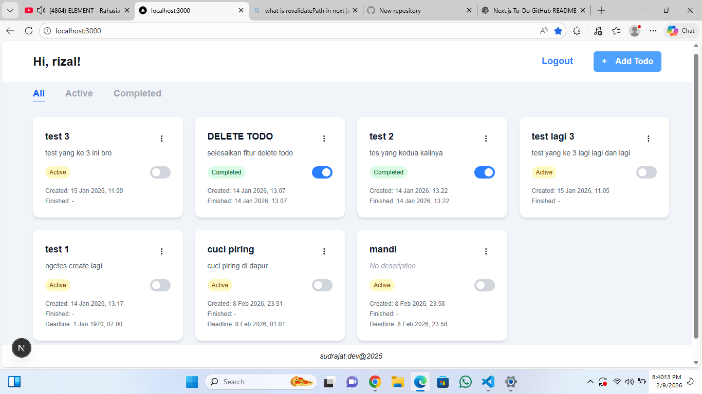
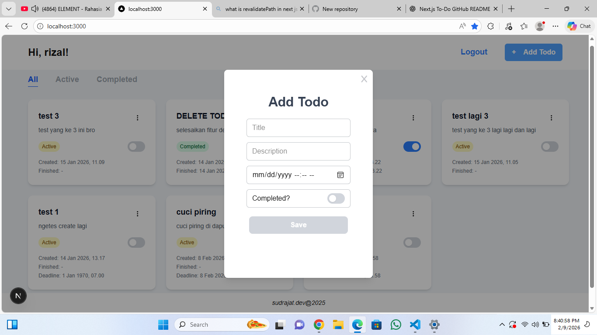
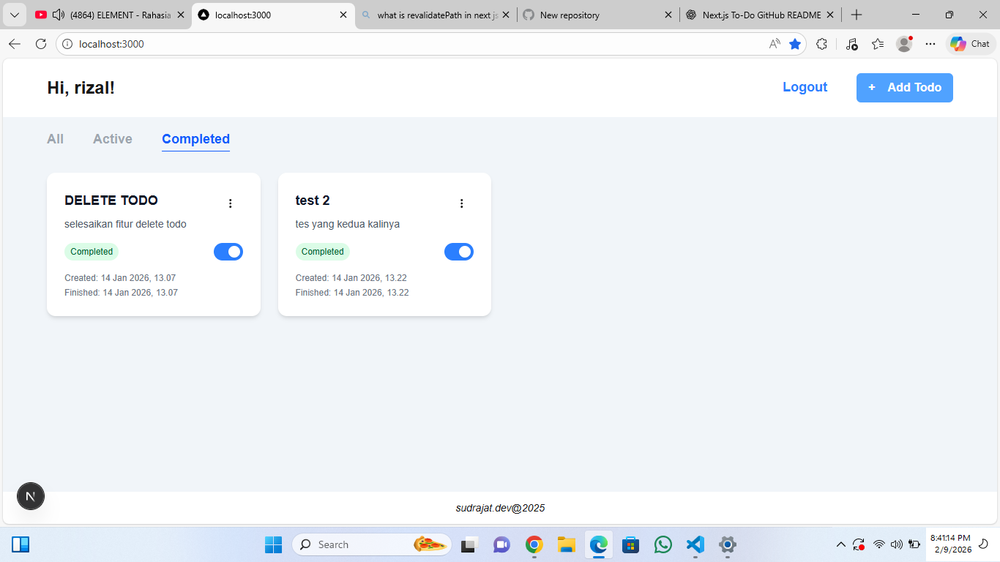

Lu bisa langsung copy paste ini 👇

# 📝 Next.js To-Do List Application

A simple and modern To-Do List web application built using **Next.js**, **NextAuth**, **Prisma**, and **PostgreSQL**.  
This application allows users to manage daily tasks securely with authentication support.

---

## 🚀 Features

- 🔐 Authentication using NextAuth
- 👤 User-based To-Do management
- ✅ Create, Read, Update, Delete (CRUD) To-Dos
- 🎨 Automatic/random background color for new To-Dos
- 📂 Structured routing using Next.js App Router
- 🛡 Protected dashboard access (only logged-in users)
- ⚡ Modern UI using Tailwind CSS
- 🗄 Database integration using Prisma ORM & PostgreSQL

---

## 🧰 Tech Stack

### Frontend

- Next.js
- React
- Tailwind CSS

### Backend

- Next.js API Routes
- NextAuth Authentication

### Database

- PostgreSQL
- Prisma ORM

---

## 📦 Installation & Setup

### 1️⃣ Clone Repository

bash
git clone https://github.com/USERNAME/REPO_NAME.git
cd REPO_NAME

2️⃣ Install Dependencies
npm install

3️⃣ Setup Environment Variables

Create .env file:

DATABASE_URL="your_postgresql_connection"
NEXTAUTH_SECRET="your_secret_key"
NEXTAUTH_URL="http://localhost:3000"

4️⃣ Run Prisma Migration
npx prisma migrate dev

5️⃣ Run Development Server
npm run dev

Open browser:

http://localhost:3000

📁 Project Structure
/app
/api
/dashboard
/auth
/components
/lib
/prisma

🎯 Purpose of This Project
This project was created to:
Practice fullstack development using Next.js ecosystem
Learn authentication flow using NextAuth
Implement database ORM using Prisma
Improve UI/UX and error handling
Serve as portfolio project

nextjs
react
prisma
postgresql
nextauth
fullstack
todo-app
